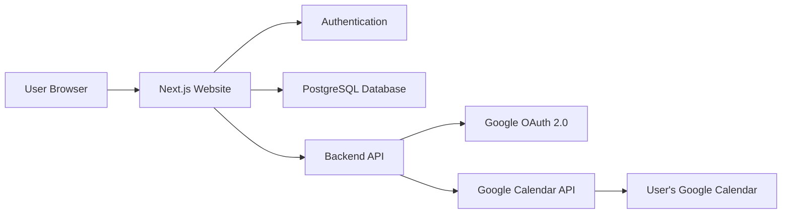
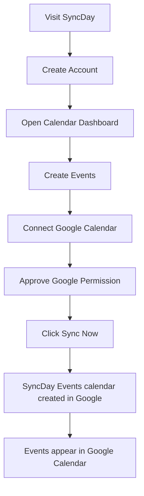

Yes, this can become a real product. The key decision is that you should build a **calendar app inspired by Google Calendar**, not a copy presented as Google Calendar. Users connect their Google account and sync events through the official Google Calendar API.

## Product Concept

Your app could let users:

- Sign up with email or Google.
- View a clean calendar in month/week/day mode.
- Create, edit and delete events in your app.
- Click **Connect Google Calendar**.
- Click **Sync Now** to copy events into Google Calendar.
- Later, enable automatic two-way syncing.

A good product angle is not simply “another Google Calendar,” but something with a purpose, such as:

- Student planner that syncs classes and deadlines.
- Content creator schedule.
- Simple family calendar.
- Interview/job application planner.
- AI-assisted schedule planner.
- Event calendar for communities or teams.

## Important Difference: Sign In vs Connect Calendar

These are separate actions:

1. **Sign in with Google**
   - Lets a user create/login to an account in your app.
   - Uses basic profile information.

2. **Connect Google Calendar**
   - Asks permission to read or write calendar events.
   - Uses Google OAuth consent and Calendar API scopes.

A user might sign up with email, then separately connect Google Calendar.

## Recommended MVP

Start with a controlled one-way sync product:

1. User creates an account.
2. User creates events in your app.
3. User connects Google Calendar.
4. User clicks **Sync to Google Calendar**.
5. Your app creates those events in their Google Calendar.
6. Your app stores the Google event ID so clicking sync again does not duplicate events.

This is much simpler and safer than starting with full two-way real-time sync.

### MVP Pages

- Landing page
- Sign up / sign in
- Calendar dashboard
- Create/edit event modal
- Settings page
- Google Calendar connection screen
- Sync history/status screen

### MVP Event Fields

- Title
- Start date and time
- End date and time
- All-day event option
- Description
- Location
- Time zone
- Reminder
- Sync status: `not synced`, `synced`, `failed`

## User Experience

A good first-time user flow:

1. User visits your site.
2. Signs up using Google or email.
3. Sees an empty calendar.
4. Creates an event, such as “Math Exam - Friday 10 AM.”
5. Clicks **Connect Google Calendar**.
6. Google shows permission screen.
7. User approves.
8. User clicks **Sync Events**.
9. App shows: “3 events successfully added to your Google Calendar.”
10. Events appear in their Google Calendar app and phone.

Useful interface ideas:

- **Sync Now** button in the header.
- Small Google icon beside synced events.
- Last synced timestamp.
- Conflict warning if an event changed in both places.
- Toggle: “Automatically sync future events.”

## Technology Stack

For a modern, manageable implementation:

| Area | Recommended Technology |
|---|---|
| Frontend | Next.js with React |
| Styling | Tailwind CSS |
| Calendar UI | FullCalendar or React Big Calendar |
| Backend | Next.js server actions/API routes, or Node.js/Express |
| Database | PostgreSQL |
| Database tooling | Prisma |
| Authentication | Auth.js or Clerk |
| Deployment | Vercel |
| Database hosting | Supabase or Neon |
| Google integration | Google Calendar API + Google Identity Services |

This stack is beginner-friendly enough, but also strong enough to launch a serious version.

## Core Architecture



Your database stores your app's events. Google Calendar remains a connected external calendar.

## Database Design

You will likely need these main tables:

### `users`

- `id`
- `name`
- `email`
- `created_at`

### `google_accounts`

- `id`
- `user_id`
- `google_email`
- `encrypted_refresh_token`
- `access_token_expiry`
- `connected_at`
- `revoked_at`

### `events`

- `id`
- `user_id`
- `title`
- `description`
- `location`
- `start_time`
- `end_time`
- `timezone`
- `is_all_day`
- `created_at`
- `updated_at`

### `event_sync_links`

- `id`
- `event_id`
- `google_calendar_id`
- `google_event_id`
- `last_synced_at`
- `sync_status`
- `sync_error`

That last table prevents duplicates and lets you update an already-synced event instead of creating a new copy.

## Google Calendar Connection

You need to set up:

1. A Google Cloud project.
2. Google Calendar API enabled.
3. OAuth consent screen.
4. OAuth web client credentials.
5. Authorized domain and redirect URL.
6. Privacy policy and terms page before public launch.

For a web app that should sync later without the user being present, use Google's **OAuth authorization code flow**. Your backend receives a code, exchanges it for tokens, and stores the refresh token securely.

Google currently recommends the authorization code model, with popup UX giving a good balance of security and usability for browser apps.

## Permissions You Should Request

Do not request full calendar access unless you truly need it.

For the MVP, you have two good choices:

### Best controlled option

Use:

```text
https://www.googleapis.com/auth/calendar.app.created
```

This lets your app create a separate Google calendar, for example **StudyFlow Events**, and manage events only on that app-created calendar.

Benefits:

- Safer for users.
- Clear separation from personal events.
- Lower chance of deleting or altering important personal events.
- Easier to explain on the consent screen.

### More flexible option

Use:

```text
https://www.googleapis.com/auth/calendar.events.owned
```

This lets your app view and modify events on calendars the user owns, including their primary calendar.

For a first version, I strongly recommend creating a separate app-managed Google calendar. Users can still see its events inside Google Calendar, alongside their normal schedule.

## How One-Click Sync Works

When the user presses **Sync Events**:

1. Backend checks that the Google account is connected.
2. Backend refreshes the Google access token if necessary.
3. Backend finds app events that are new or edited.
4. For each event:
   - If it has never synced, call Google Calendar `events.insert`.
   - If it already has a Google event ID, update that Google event.
5. Store the Google event IDs and sync timestamps.
6. Show success or any failed events to the user.

When creating events, provide your own stable event identifier or save Google's returned event ID. This prevents duplicate events when a request is retried.

## Two-Way Sync Later

Two-way sync means:

- Events created in your app appear in Google Calendar.
- Events changed in Google Calendar update inside your app.
- Deleted events are handled correctly.
- Conflicts are resolved.

This is achievable, but it is the more complex part of the product.

Google Calendar supports incremental syncing using a `syncToken`:

1. Your app performs an initial full sync.
2. Google returns a `nextSyncToken`.
3. You store it.
4. On future syncs, request only changes since that token.
5. If Google returns HTTP `410`, the token is no longer valid and you must perform a new full sync.

For near-real-time updates, Google Calendar also supports push notification channels to an HTTPS webhook. A push notification tells your server something changed; your server then requests the actual updated events.

### Recommended rollout

| Version | Sync Capability |
|---|---|
| V1 | Manual app-to-Google sync |
| V2 | Automatic app-to-Google sync |
| V3 | Import Google events into your app |
| V4 | Two-way sync with conflict handling |
| V5 | Near-real-time sync using webhooks |

## Security Requirements

This is important because calendar events contain private information.

You should:

- Store refresh tokens only on your backend.
- Encrypt refresh tokens in your database.
- Never store Google client secret in frontend code.
- Use HTTPS only in production.
- Use secure sessions and CSRF protection.
- Let users disconnect Google Calendar.
- Revoke tokens when users disconnect or delete accounts.
- Provide a privacy policy explaining calendar data access.
- Log sync failures, but avoid logging sensitive event descriptions unnecessarily.
- Request the smallest OAuth permission possible.

## Google Verification

Because your app will access Google Calendar data, a public production app will likely need Google's OAuth verification process.

Google's official documentation says apps requesting sensitive calendar-related scopes may require verification before public launch. You should plan for:

- Verified domain ownership.
- Public homepage.
- Privacy policy.
- Clear explanation of why calendar access is needed.
- A demo video showing OAuth and calendar use.
- Matching scopes in your code and Google Cloud consent configuration.

During development you can add test users, but an unverified public app may show warnings or face user limits.

## Features That Would Make It Feel Excellent

After the MVP works, these features will make the product more polished:

### Calendar Experience

- Month, week and day views.
- Drag-and-drop event movement.
- Resize event duration.
- Recurring events.
- Color-coded calendars.
- Keyboard shortcuts.
- Mobile responsive layout.

### Sync Experience

- Sync status badge on every event.
- “Last synced 2 minutes ago.”
- Retry failed event sync.
- Duplicate prevention.
- Conflict resolution screen.
- Disconnect and reconnect account.
- Choose which Google calendar receives events.

### Product Differentiators

- Natural-language creation: “Meeting with Riya tomorrow at 3 PM.”
- Smart recurring class timetable.
- Goal scheduling.
- Deadline reminders.
- Shared calendars.
- Printable schedule view.
- Schedule templates.
- Import from CSV or school timetable.

## Legal and Branding Note

Avoid calling your app “Google Calendar Clone” publicly or copying Google's branding exactly.

You can say:

- “Syncs with Google Calendar”
- “Connect your Google Calendar”
- “Calendar app with Google Calendar integration”

Use your own app name, logo and visual design. This builds trust and avoids confusing users into thinking your product is operated by Google.

## Practical Development Roadmap

### Phase 1: Design and Basic App

- Choose product name and target user.
- Design dashboard and calendar screens.
- Build authentication.
- Build local event creation and editing.
- Store events in PostgreSQL.

### Phase 2: Google Integration

- Set up Google Cloud project.
- Enable Calendar API.
- Build OAuth connection.
- Securely save tokens.
- Add **Sync to Google Calendar** button.
- Store Google event mapping to prevent duplicates.

### Phase 3: Quality and Launch Preparation

- Handle failed syncs.
- Add disconnect/revoke feature.
- Add privacy policy and terms.
- Test time zones and all-day events.
- Prepare Google OAuth verification.
- Deploy production version.

### Phase 4: Advanced Sync

- Import Google Calendar events.
- Store sync tokens.
- Add automatic syncing.
- Implement webhook notifications.
- Build conflict resolution.

## Approximate Build Difficulty

| Version | Time for One Developer | Difficulty |
|---|---:|---|
| UI prototype only | 2-5 days | Easy |
| Working app with accounts/events | 1-2 weeks | Moderate |
| Google one-click export sync | 1-2 additional weeks | Moderate |
| Reliable two-way sync | 3-6 additional weeks | Hard |
| Polished public launch | 1-3 months total | Moderate to hard |

## Best First Version

The strongest initial product would be:

> A clean personal planner where users create events, connect Google Calendar, and sync their planner events into a dedicated Google calendar with one click.

That version is useful, technically realistic, safer with permissions, and leaves plenty of room for improvements.

## Official Sources

- [Google Identity Services: OAuth authorization code model](https://developers.google.com/identity/oauth2/web/guides/use-code-model)
- [Google Calendar API scopes](https://developers.google.com/workspace/calendar/api/auth)
- [Google Calendar incremental synchronization](https://developers.google.com/workspace/calendar/api/guides/sync)
- [Google OAuth sensitive scope verification](https://developers.google.com/identity/protocols/oauth2/production-readiness/sensitive-scope-verification)
- [Google Calendar API quota guidance](https://developers.google.com/workspace/calendar/api/guides/quota)


Absolutely. Build a small, real product first, with a path to more advanced Google syncing later.

As of **May 27, 2026**, you can develop and test this at `$0` using free tiers. The main non-cost barrier is that public Google Calendar access may require OAuth verification before opening the app widely.

## 1. Recommended Product

Use a temporary name such as **SyncDay**:

> A simple personal planner where users add events, connect Google Calendar, and sync their planned events into a dedicated Google calendar with one click.

### V1 Scope

Build only:

- Landing page.
- Email sign up / login.
- Dashboard calendar.
- Create, update and delete events.
- Connect Google Calendar.
- One-click **Sync to Google Calendar**.
- Sync history and connection settings.

Do not begin with:

- Two-way sync.
- Real-time Google updates.
- Shared calendars.
- AI planning.
- Complex recurring event rules.

Those features are good later, but they multiply debugging work.

---

## 2. Free Technology Stack

| Need | Choice | Cost For MVP |
|---|---|---:|
| Web application | Next.js App Router + TypeScript | Free |
| UI styling | Tailwind CSS + shadcn/ui | Free |
| Calendar component | FullCalendar Standard | Free, MIT license |
| Authentication | Supabase Auth | Free tier |
| Database | Supabase PostgreSQL | Free tier |
| Hosting | Netlify Free | Free with hard monthly limits |
| Code hosting | GitHub | Free |
| Google sync | Google Calendar API | No additional API cost |
| Development URL | Netlify subdomain | Free |

### Why Not Vercel Free?

Vercel is excellent for Next.js, but its Hobby plan is officially for **personal, non-commercial use**. Since this may become a public product, use **Netlify Free** for the initial deployed app. Netlify currently supports Next.js App Router, Route Handlers and Server Actions.

### Current Free-Tier Reality

- **Supabase Free**: 2 active projects, 500 MB database per project, 50,000 monthly active users, 5 GB egress.
- **Netlify Free**: `$0`, with a 300-credit monthly hard limit; once consumed, the site pauses until the next monthly cycle unless upgraded.
- **FullCalendar Standard**: free under the MIT license.
- **Google Calendar API**: available at no additional cost, subject to quotas.

Free is suitable for building, demos and early testers. A genuinely popular public product eventually requires paid hosting/database capacity.

---

## 3. Important Google Decision

For V1, do **not** write events directly into the user’s personal default calendar.

Instead, your app should create a separate Google Calendar named:

```text
SyncDay Events
```

Then your app manages only events in that calendar.

Use this Google permission:

```text
https://www.googleapis.com/auth/calendar.app.created
```

It permits your app to create secondary calendars and manage events on calendars it created.

### Why This Is Better

- The app cannot accidentally modify personal appointments.
- Users can enable or hide the SyncDay calendar inside Google Calendar.
- Permissions are easier to explain.
- Synchronization is simpler.
- Deleting an app-created event is less frightening to users.

---

## 4. User Flow



### First-Time Experience

1. User signs up using email.
2. User lands on an empty calendar.
3. User creates several events.
4. Banner says: `Connect Google Calendar to sync your schedule`.
5. User connects Google.
6. User clicks **Sync Now**.
7. App creates a `SyncDay Events` Google calendar.
8. Events appear in that calendar.
9. Dashboard shows each event as `Synced`.

### Why Email Login First

Keep app authentication separate from Google Calendar permission.

- Supabase handles account login.
- Google Calendar authorization happens only when the user intentionally clicks **Connect Google Calendar**.

This avoids asking for calendar permissions during registration.

---

## 5. Application Pages

Your application should have these routes:

| URL | Screen | Purpose |
|---|---|---|
| `/` | Landing page | Explain product and get sign-ups |
| `/login` | Login | User sign in |
| `/signup` | Sign up | New account creation |
| `/dashboard` | Calendar dashboard | Main product experience |
| `/dashboard/event/new` | Create event modal/page | Add event |
| `/dashboard/settings` | Settings | Account preferences |
| `/dashboard/integrations` | Google connection | Connect/disconnect Google |
| `/dashboard/sync-history` | Sync history | Show success and failure status |
| `/privacy` | Privacy policy | Required before public Google launch |
| `/terms` | Terms | Product/legal information |

---

## 6. Screen Layouts

## Landing Page

```text
 -------------------------------------------------------------
 | SyncDay                                      Log in  Sign up |
 -------------------------------------------------------------
 |                                                             |
 |       Plan your day. Sync it to Google Calendar.            |
 |                                                             |
 |       A simple calendar that sends your planned             |
 |       events to Google Calendar in one click.               |
 |                                                             |
 |       [ Start Free ]     [ See How It Works ]               |
 |                                                             |
 |       -------------------------------------------           |
 |       | Calendar product screenshot / preview   |           |
 |       -------------------------------------------           |
 |                                                             |
 |       Create events -> Connect Google -> Sync instantly     |
 |                                                             |
 -------------------------------------------------------------
 | Privacy Policy                    Terms                     |
 -------------------------------------------------------------
```

### Landing Sections

- Hero message.
- Calendar screenshot.
- Three-step explanation.
- Security promise: your app syncs only its own calendar.
- Call to action.
- Privacy and terms links.

---

## Sign Up Screen

```text
 ------------------------------------------
 |              Create Account             |
 |                                          |
 |  Email                                   |
 |  [____________________________________]  |
 |                                          |
 |  Password                                |
 |  [____________________________________]  |
 |                                          |
 |  [ Create Account ]                      |
 |                                          |
 |  Already have an account? Log in         |
 ------------------------------------------
```

For the first version, email/password or email magic link is enough. Add Google sign-in later.

---

## Main Dashboard

```text
 --------------------------------------------------------------------
 | SyncDay       Search events...       [Sync Now]   Profile Avatar  |
 --------------------------------------------------------------------
 | Sidebar              | Calendar                                    |
 |                      |                                             |
 | [+ Create Event]     |   < May 2026 >       Month  Week  Day        |
 |                      |                                             |
 | My Calendar          |  Sun Mon Tue Wed Thu Fri Sat                 |
 | [x] Personal Planner |       1   2   3   4   5   6                 |
 |                      |   7   8   9  10  11  12  13                 |
 | Google Calendar      |                                             |
 | Connected / Not set  |       [Design Review 10:00 AM]              |
 |                      |       [Assignment Due]                      |
 | Last Sync            |                                             |
 | 2 minutes ago        |                                             |
 |                      |                                             |
 | Settings             |                                             |
 | Sync History         |                                             |
 --------------------------------------------------------------------
```

### Dashboard Components

- Top navigation.
- Create event button.
- Month/week/day selector.
- Calendar grid.
- Google connection status.
- Last sync timestamp.
- Sync button.
- Event sync indicators.

### Sync Button States

| State | Button Text |
|---|---|
| Google not connected | `Connect Google Calendar` |
| Connected, unsynced changes exist | `Sync 4 Events` |
| Sync in progress | `Syncing...` |
| Everything current | `Synced` |
| Error occurred | `Retry Sync` |

---

## Create Event Modal

```text
 --------------------------------------------
 | Create Event                         [X] |
 |                                            |
 | Event title                               |
 | [ Team planning meeting                ] |
 |                                            |
 | Date           Start       End            |
 | [ May 29 ]     [ 10:00 ]   [ 11:00 ]      |
 |                                            |
 | [ ] All day event                         |
 |                                            |
 | Location                                  |
 | [ Online                                ] |
 |                                            |
 | Description                               |
 | [ Discuss launch priorities            ] |
 |                                            |
 | Color                                     |
 | [ Blue v ]                                |
 |                                            |
 |              [ Cancel ] [ Save Event ]    |
 --------------------------------------------
```

### V1 Event Fields

- Title, required.
- Start date/time, required.
- End date/time, required.
- All-day checkbox.
- Description.
- Location.
- Color.
- Time zone captured automatically.

Leave recurring events until V2.

---

## Google Integration Screen

```text
 ------------------------------------------------------
 | Integrations                                          |
 |                                                       |
 | Google Calendar                                       |
 |                                                       |
 | Keep your SyncDay events available on every device.   |
 | We create a separate calendar called SyncDay Events.  |
 | We do not edit your personal calendar events.         |
 |                                                       |
 | [ Connect Google Calendar ]                           |
 |                                                       |
 | Permission requested:                                 |
 | Create and manage the SyncDay Events calendar only.   |
 ------------------------------------------------------
```

### Connected State

```text
 ------------------------------------------------------
 | Google Calendar                    Connected         |
 | Account: user@gmail.com                              |
 | Calendar: SyncDay Events                             |
 | Last sync: Today, 4:32 PM                            |
 |                                                       |
 | [ Sync Now ]        [ Disconnect ]                   |
 ------------------------------------------------------
```

---

## Sync History Screen

```text
 -----------------------------------------------------------
 | Sync History                                              |
 |                                                           |
 | Today                                                     |
 | 4:32 PM   Synced 5 events successfully          Success   |
 | 2:10 PM   Updated "Dentist appointment"         Success   |
 |                                                           |
 | Yesterday                                                 |
 | 6:14 PM   Failed to sync "Project Review"       Retry     |
 -----------------------------------------------------------
```

This screen matters because users need confidence that synchronization really happened.

---

## 7. Project Folder Structure

Create one Next.js project folder:

```text
syncday/
├─ public/
│  ├─ logo.svg
│  ├─ calendar-preview.png
│  └─ icons/
│     └─ google-calendar.svg
│
├─ src/
│  ├─ app/
│  │  ├─ layout.tsx
│  │  ├─ globals.css
│  │  ├─ page.tsx
│  │  │
│  │  ├─ (auth)/
│  │  │  ├─ layout.tsx
│  │  │  ├─ login/
│  │  │  │  └─ page.tsx
│  │  │  └─ signup/
│  │  │     └─ page.tsx
│  │  │
│  │  ├─ (dashboard)/
│  │  │  ├─ dashboard/
│  │  │  │  ├─ layout.tsx
│  │  │  │  ├─ page.tsx
│  │  │  │  ├─ integrations/
│  │  │  │  │  └─ page.tsx
│  │  │  │  ├─ settings/
│  │  │  │  │  └─ page.tsx
│  │  │  │  └─ sync-history/
│  │  │  │     └─ page.tsx
│  │  │
│  │  ├─ privacy/
│  │  │  └─ page.tsx
│  │  ├─ terms/
│  │  │  └─ page.tsx
│  │  │
│  │  ├─ auth/
│  │  │  └─ callback/
│  │  │     └─ route.ts
│  │  │
│  │  └─ api/
│  │     ├─ events/
│  │     │  ├─ route.ts
│  │     │  └─ [eventId]/
│  │     │     └─ route.ts
│  │     ├─ google/
│  │     │  ├─ connect/
│  │     │  │  └─ route.ts
│  │     │  ├─ callback/
│  │     │  │  └─ route.ts
│  │     │  ├─ disconnect/
│  │     │  │  └─ route.ts
│  │     │  └─ sync/
│  │     │     └─ route.ts
│  │     └─ sync-history/
│  │        └─ route.ts
│  │
│  ├─ components/
│  │  ├─ ui/
│  │  │  ├─ button.tsx
│  │  │  ├─ input.tsx
│  │  │  ├─ dialog.tsx
│  │  │  ├─ badge.tsx
│  │  │  └─ toast.tsx
│  │  ├─ landing/
│  │  │  ├─ hero.tsx
│  │  │  ├─ features.tsx
│  │  │  └─ product-preview.tsx
│  │  ├─ calendar/
│  │  │  ├─ calendar-view.tsx
│  │  │  ├─ event-modal.tsx
│  │  │  ├─ event-card.tsx
│  │  │  └─ view-switcher.tsx
│  │  ├─ dashboard/
│  │  │  ├─ sidebar.tsx
│  │  │  ├─ topbar.tsx
│  │  │  └─ sync-button.tsx
│  │  └─ integrations/
│  │     └─ google-calendar-card.tsx
│  │
│  ├─ lib/
│  │  ├─ supabase/
│  │  │  ├─ client.ts
│  │  │  ├─ server.ts
│  │  │  ├─ admin.ts
│  │  │  └─ middleware.ts
│  │  ├─ google/
│  │  │  ├─ oauth.ts
│  │  │  ├─ calendar.ts
│  │  │  └─ scopes.ts
│  │  ├─ crypto/
│  │  │  └─ tokens.ts
│  │  ├─ validation/
│  │  │  └─ event-schema.ts
│  │  └─ utils.ts
│  │
│  ├─ actions/
│  │  ├─ auth-actions.ts
│  │  ├─ event-actions.ts
│  │  └─ sync-actions.ts
│  │
│  ├─ types/
│  │  ├─ event.ts
│  │  ├─ google.ts
│  │  └─ database.ts
│  │
│  └─ middleware.ts
│
├─ supabase/
│  ├─ migrations/
│  │  ├─ 001_create_profiles.sql
│  │  ├─ 002_create_events.sql
│  │  ├─ 003_create_google_connections.sql
│  │  ├─ 004_create_event_sync_links.sql
│  │  └─ 005_create_sync_logs.sql
│  └─ seed.sql
│
├─ tests/
│  ├─ event-validation.test.ts
│  ├─ token-encryption.test.ts
│  └─ sync-mapping.test.ts
│
├─ .env.local.example
├─ .gitignore
├─ next.config.ts
├─ package.json
├─ tailwind.config.ts
├─ tsconfig.json
└─ README.md
```

---

## 8. What Each Important Folder Does

| Folder | Purpose |
|---|---|
| `src/app` | Pages and backend API endpoints |
| `src/components` | Reusable UI pieces |
| `src/lib/supabase` | Authentication and database clients |
| `src/lib/google` | Google OAuth and Calendar API functions |
| `src/lib/crypto` | Token encryption and decryption |
| `src/actions` | Server-side form operations |
| `supabase/migrations` | Database setup SQL |
| `tests` | Important behavior tests |

### Keep These Files Server-Only

These files must never be imported into client components:

```text
src/lib/supabase/admin.ts
src/lib/google/oauth.ts
src/lib/google/calendar.ts
src/lib/crypto/tokens.ts
```

They handle secret keys and Google tokens.

---

## 9. Database Tables

Use Supabase PostgreSQL.

### `profiles`

```text
id                 uuid, primary key, linked to auth user
display_name       text
timezone           text
created_at         timestamp
updated_at         timestamp
```

### `events`

```text
id                 uuid, primary key
user_id            uuid
title              text
description        text
location           text
start_at           timestamp with timezone
end_at             timestamp with timezone
is_all_day         boolean
color              text
sync_status        text: pending | synced | failed
created_at         timestamp
updated_at         timestamp
```

### `google_connections`

```text
id                         uuid, primary key
user_id                    uuid, unique
google_email               text
encrypted_refresh_token    text
google_calendar_id         text
connected_at               timestamp
last_synced_at             timestamp
revoked_at                 timestamp nullable
```

### `event_sync_links`

```text
id                         uuid, primary key
event_id                   uuid, unique
user_id                    uuid
google_event_id            text
google_calendar_id         text
last_synced_at             timestamp
last_event_updated_at      timestamp
```

### `sync_logs`

```text
id                 uuid, primary key
user_id            uuid
sync_type          text
events_attempted   integer
events_succeeded   integer
events_failed      integer
error_message      text nullable
created_at         timestamp
```

## Database Security

Enable Supabase Row Level Security for user-facing tables:

- A user can only read and change their own `events`.
- A user can only read their own sync status.
- Browser code should never read `encrypted_refresh_token`.
- Google tokens should only be read by authenticated server routes.

---

## 10. API Endpoints

| Endpoint | Method | Purpose |
|---|---|---|
| `/api/events` | `GET` | Load the user’s events |
| `/api/events` | `POST` | Create an event |
| `/api/events/[eventId]` | `PATCH` | Edit an event |
| `/api/events/[eventId]` | `DELETE` | Delete an event |
| `/api/google/connect` | `GET` | Begin Google OAuth |
| `/api/google/callback` | `GET` | Save Google permission/token |
| `/api/google/sync` | `POST` | Sync app events to Google |
| `/api/google/disconnect` | `POST` | Disconnect and revoke Google access |
| `/api/sync-history` | `GET` | Load synchronization logs |

---

## 11. Google Sync Implementation

### Connecting Google Calendar

When the user clicks **Connect Google Calendar**:

1. Redirect them to Google's OAuth consent page.
2. Request offline access with the narrow scope:
   ```text
   https://www.googleapis.com/auth/calendar.app.created
   ```
3. Google redirects to:
   ```text
   /api/google/callback
   ```
4. Your backend exchanges the authorization code for tokens.
5. Encrypt and store the refresh token.
6. Create the `SyncDay Events` Google calendar.
7. Store its Google calendar ID.

### Syncing Events

When the user clicks **Sync Now**:

1. Confirm the user is signed in.
2. Load their Google connection.
3. Decrypt their refresh token server-side.
4. Obtain an active Google access token.
5. Load events marked `pending` or changed since their last sync.
6. For each event:
   - No `google_event_id`: create event in Google Calendar.
   - Has `google_event_id`: update the matching Google event.
7. Save returned IDs to `event_sync_links`.
8. Set event status to `synced`.
9. Create a `sync_logs` record.
10. Show a toast: `5 events synced successfully`.

### Preventing Duplicate Events

Never blindly insert every event every time the button is clicked.

Use:

```text
your event id -> Google event id
```

stored in `event_sync_links`. That mapping is essential.

---

## 12. Environment Variables

Create `.env.local.example` containing only placeholder names:

```bash
NEXT_PUBLIC_APP_URL=http://localhost:3000

NEXT_PUBLIC_SUPABASE_URL=
NEXT_PUBLIC_SUPABASE_ANON_KEY=
SUPABASE_SERVICE_ROLE_KEY=

GOOGLE_CLIENT_ID=
GOOGLE_CLIENT_SECRET=
GOOGLE_REDIRECT_URI=http://localhost:3000/api/google/callback

TOKEN_ENCRYPTION_KEY=
```

### Secrets Rule

These must never appear in browser code or GitHub:

```text
SUPABASE_SERVICE_ROLE_KEY
GOOGLE_CLIENT_SECRET
TOKEN_ENCRYPTION_KEY
encrypted_refresh_token values
```

---

## 13. Build Roadmap

## Phase 0: Product Setup

**Goal:** Decide exactly what is being built.

Tasks:

- Choose app name and basic brand colors.
- Create a GitHub repository.
- Create a Supabase free project.
- Create a Netlify free account.
- Create a Google Cloud project.
- Write a one-page product scope.

Deliverable:

```text
A project README describing V1 features and technical choices.
```

---

## Phase 1: Project Foundation

**Goal:** Running app with routes and shared layout.

Tasks:

- Create Next.js app with TypeScript and Tailwind.
- Install UI components.
- Build landing page.
- Build login and signup screens.
- Build empty dashboard shell.
- Add navigation and responsive sidebar.

Deliverable:

```text
A clickable UI with no calendar functionality yet.
```

Suggested commands:

```bash
npx create-next-app@latest syncday --typescript --tailwind --eslint --app --src-dir
cd syncday
npm install @supabase/supabase-js @supabase/ssr
npm install @fullcalendar/core @fullcalendar/react @fullcalendar/daygrid @fullcalendar/timegrid @fullcalendar/interaction
npm install zod date-fns
```

---

## Phase 2: Authentication

**Goal:** Users can create accounts and access private dashboards.

Tasks:

- Configure Supabase Auth.
- Implement sign up.
- Implement login.
- Implement logout.
- Protect `/dashboard`.
- Create a `profiles` row when a user registers.
- Add loading and error states.

Deliverable:

```text
Each user has their own private dashboard.
```

---

## Phase 3: Local Calendar Events

**Goal:** Calendar works without Google yet.

Tasks:

- Create `events` table and Row Level Security policies.
- Render FullCalendar in `/dashboard`.
- Build create event modal.
- Implement create/update/delete.
- Add month/week/day switching.
- Add event colors.
- Validate event times and required fields.

Deliverable:

```text
Users can manage their schedule inside SyncDay.
```

---

## Phase 4: Google Connection

**Goal:** A user can safely connect Google Calendar.

Tasks:

- Enable Google Calendar API.
- Configure OAuth consent screen.
- Set test users.
- Configure OAuth web client.
- Build `/api/google/connect`.
- Build `/api/google/callback`.
- Encrypt refresh token before storage.
- Build integrations settings page.
- Add disconnect operation.

Deliverable:

```text
Dashboard displays Connected to Google Calendar.
```

### Development Limitation

While your Google OAuth application is in **Testing** mode for external users:

- You can add up to 100 test users.
- Calendar-related refresh tokens expire after 7 days.

That is okay for development. A longer-lived public product requires moving through Google's production process and, depending on requested scopes, verification.

---

## Phase 5: One-Click Sync

**Goal:** Your defining product feature works.

Tasks:

- Create `SyncDay Events` secondary Google calendar.
- Implement `/api/google/sync`.
- Sync new events.
- Sync edited events.
- Store Google event IDs.
- Prevent duplicate creation.
- Add loading indicator.
- Add success/failure toasts.
- Add sync history table.

Deliverable:

```text
User clicks one button and their SyncDay events appear in Google Calendar.
```

---

## Phase 6: Product Polish

**Goal:** Make the app feel trustworthy and launch-ready.

Tasks:

- Responsive mobile layout.
- Empty calendar onboarding state.
- Connection warnings.
- Retry failed syncs.
- Account deletion.
- Google disconnect and token revoke.
- Privacy policy.
- Terms page.
- Branded favicon and basic product visuals.
- Manual testing across time zones and all-day events.

Deliverable:

```text
A solid private beta product for invited testers.
```

---

## 14. Timeline

| Week | Main Objective |
|---|---|
| Week 1 | Project setup, landing page, dashboard layout |
| Week 2 | Supabase auth and protected pages |
| Week 3 | Calendar event CRUD |
| Week 4 | Google OAuth connection |
| Week 5 | One-click Google Calendar sync |
| Week 6 | Testing, security, mobile polish and deployment |

A beginner may need longer, which is normal. The difficult feature is not the UI; it is handling OAuth and sync correctly.

---

## 15. Testing Checklist

### Authentication

- User can sign up.
- User can log in and log out.
- User cannot access another user’s events.
- Dashboard cannot be opened while logged out.

### Events

- Event title is required.
- End time cannot be earlier than start time.
- All-day events display correctly.
- Events persist after refresh.
- Editing and deletion work.

### Google Connection

- Google connection succeeds.
- Rejected permission is handled cleanly.
- Disconnect removes access from the app.
- Tokens never reach browser JavaScript.

### Sync

- First sync creates events.
- Second sync does not duplicate events.
- Changed events update in Google.
- Failed events show an error.
- Events use the correct time zone.
- All-day events appear on the correct date.

---

## 16. Security Checklist

Before allowing real users:

- Encrypt Google refresh tokens in the database.
- Keep Google client secret server-side only.
- Keep Supabase service-role key server-side only.
- Use HTTPS on deployment.
- Enable Row Level Security in Supabase.
- Validate all event input with `zod`.
- Require an authenticated user for every event and sync API route.
- Provide disconnect functionality.
- Provide account deletion functionality.
- Avoid logging token values or private event descriptions.
- Use a separate Google Cloud test project and production project, as Google recommends.

---

## 17. Features For Later Versions

### V2

- Automatic sync whenever an event is saved.
- Recurring events.
- Event reminders.
- Google sign-in option.
- Import events from Google Calendar.

### V3

- Two-way synchronization.
- Google webhook notifications.
- Conflict resolution.
- Multiple connected calendars.
- Shared scheduling.

### V4

- Natural-language event entry.
- Smart planning assistant.
- School/work templates.
- Calendar sharing with teams or family.

---

## 18. Exact MVP Definition

Your first released beta should meet this standard:

```text
A user can create an account, create events in a beautiful calendar,
connect Google Calendar, click Sync Now, and see their events appear
inside a dedicated SyncDay Events calendar in Google Calendar,
without duplicates or unsafe access to their personal events.
```

That is a complete, useful product.

## Official References

- [Google Calendar API scopes](https://developers.google.com/workspace/calendar/api/auth)
- [Google OAuth 2.0 and refresh token behavior](https://developers.google.com/identity/protocols/oauth2)
- [Google OAuth for web server applications](https://developers.google.com/identity/protocols/oauth2/web-server)
- [Google Calendar API quotas](https://developers.google.com/calendar/api/guides/quota)
- [Supabase free-plan limits](https://supabase.com/docs/guides/platform/billing-on-supabase)
- [Supabase Google login documentation](https://supabase.com/docs/guides/auth/social-login/auth-google)
- [Netlify Free pricing](https://www.netlify.com/pricing/)
- [Netlify support for Next.js App Router](https://docs.netlify.com/frameworks/next-js/overview/)
- [FullCalendar license](https://fullcalendar.io/license)